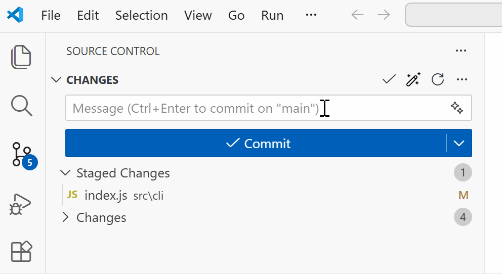
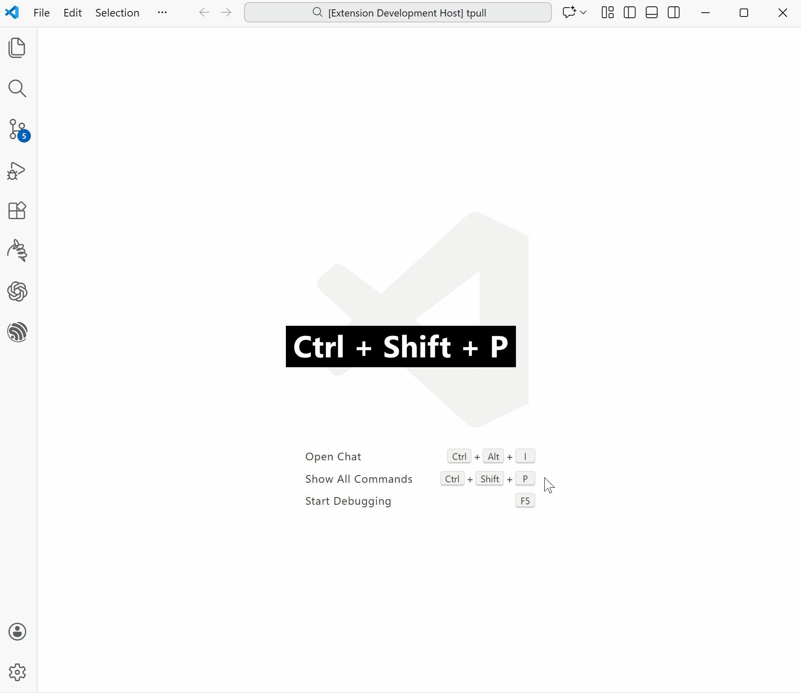

# Git Commit Composer
Easily generate concise and descriptive commit messages in seconds with AI, based on your pending code changes.

## Highlights
- AI-powered, one-click commit message generation in the Source Control panel

- Supports popular hosted and local LLM endpoints, and allows custom endpoints
- Configurable prompt template
- Supports `plain` and `conventional` output formats

## Quick Start
1. Press <kbd>Ctrl</kbd>+<kbd>Shift</kbd>+<kbd>P</kbd> (Windows/Linux) or <kbd>Cmd</kbd>+<kbd>Shift</kbd>+<kbd>P</kbd> (macOS) to open the Command Palette, type `git` to filter commands, then select the **Git Commit Composer: Open Settings View** command.

2. Select a preset provider (or add a custom provider), then select a model.
3. Enter your API key and test the connection.
4. Click the  button in the Source Control panel to auto-generate a commit message based on your pending code changes.

## Providers
Preset providers include **OpenAI**, **Anthropic**, **DeepSeek**, **Mistral AI**, **Groq**, **Together**, **Together AI**, **SiliconFlow**, **BigModel (ZhipuAI / GLM)**, **Moonshot (Kimi)**, **OpenRouter**, **Ollama (Local)**, **LM Studio (Local)**, and **vLLM (Local)**.

You can also add custom providers with:
- `name`: display name in the settings view
- `apiType`: `OpenAI` or `Anthropic`
- `endpoint`: endpoint URL
- `model`: model name

## Extension Settings
All settings live under `gitCommitComposer.*` (managed via the Settings View):
- `gitCommitComposer.providerId`: selected provider identifier
- `gitCommitComposer.customProviders`: custom provider definitions
- `gitCommitComposer.customModels`: custom model definitions per provider
- `gitCommitComposer.providerSelectedModels`: selected model per provider
- `gitCommitComposer.promptTemplate`: prompt text with template variables (`{{diff}}`, `{{format}}`, `{{input_message}}`, `{{language}}`)
- `gitCommitComposer.outputLanguage`: language for commit messages
- `gitCommitComposer.timeoutMs`: request timeout in milliseconds
- `gitCommitComposer.maxDiffSize`: maximum diff size (KB) to send
- `gitCommitComposer.outputFormat`: output format hint for the model (`plain` or `conventional`)

## Privacy & Safety
- Only diff content and prompt text are sent to your configured endpoint.
- API keys are stored in VS Code SecretStorage.
- No automatic `git commit` is performed.
